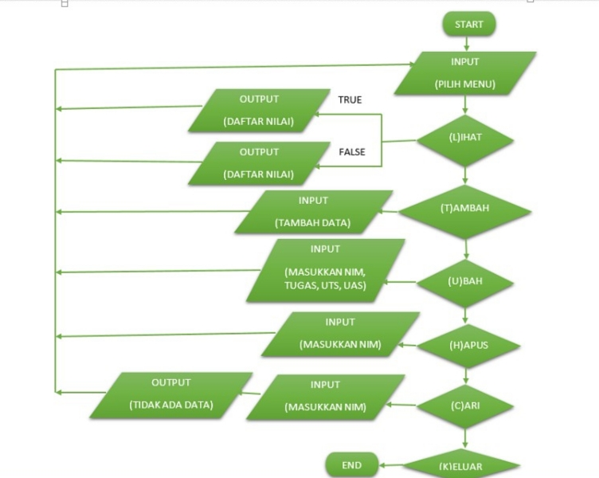

# Praktikum8
```sh
import os

class data_mhsw:
    nama=""
    nim=""
    tugas=""
    uts=""
    uas=""
    
data = []

def no_data():
        print("DAFTAR NILAI MAHASISWA")
        print("----------------------")
        print()
        print(" - TIDAK ADA DATA - ")
        print()
def tambah():
    os.system("cls")
    b = data_mhsw()
    print("TAMBAH DATA")
    print("------------")
    b.nama = (input("Nama Mahasiswa\t: "))
    b.nim = (int(input("NIM Mahasiswa\t: ")))
    b.tugas = (int(input("Nilai Tugas\t: ")))
    b.uts = (int(input("Nilai UTS\t: ")))
    b.uas = (int(input("Nilai UAS\t: ")))
    b.akhir = (b.tugas*30/100) + (b.uts*35/100) + (b.uas*35/100) 
    data.append(b)
    print()
def lihat():
    os.system("cls")
    if len(data) <=0:
        no_data()     
    else:
        for a in data:
            print("DAFTAR NILAI MAHASISWA")
            print("-----------------------")
            print("Nama Mahasiswa\t: "+a.nama)
            print("NIM Mahasiswa\t: "+str(a.nim))
            print("Nilai Tugas\t: "+str(a.tugas))
            print("Nilai UTS\t: "+str(a.uts))
            print("Nilai UAS\t: "+str(a.uas))
            print("Nilai Akhir\t: "+str(a.akhir))
            print()
def hapus():
        os.system("cls")
        if len(data) <=0:
            no_data()
        else:
            nama = data_mhsw()
            print("HAPUS DATA")
            print("----------")
            nama = (input("Nama Mahasiswa\t: "))
            for nama in data:
                data.remove(nama)
            print()
def ubah():
    os.system("cls")
    if len(data) <=0:
        no_data()
    else:
        nama = data_mhsw()
        print("UBAH DATA")
        print("---------")
        nama = (input("Nama Mahasiswa\t: "))
        for nama in data:
            nama.tugas = (int(input("Nilai Tugas\t: ")))
            nama.uts = (int(input("Nilai UTS\t: ")))
            nama.uas = (int(input("Nilai UAS\t: ")))
            akhir = (nama.tugas*30/100) + (nama.uts*35/100) + (nama.uas*35/100)
        print()
Loop = True
while Loop:
    print("Pilih Menu")
    print("----------")
    tanya = input("[(L)ihat, (T)ambah, (U)bah, (H)apus, (K)eluar] : ")
    print()

    if tanya=="l" or tanya=="L":
        lihat()
    
    elif tanya=="t" or tanya=="T":
        tambah()
    
    elif tanya=="u" or tanya=="U":
        ubah()
    
    elif tanya=="h" or tanya=="H":
        hapus()
    
    elif tanya=="k" or tanya=="K":
        print("Program Selesai")
        Loop = False
```
### Penjelasan
1. Untuk memanggil fungsi dengan nama "os".
.png)

2. Membuat class data_mhsw dengan atributnya, yaitu nama, nim, tugas, uts dan uas.
.png)

3. Membuat variable data = [] untuk menampung list dari data_mhsw.
.png)

4. Menambah data ( tambah() )

Menginput nim, nama, nilai tugas, nilai uts dan nilai uas.

Data yang telah diinput akan ditambahkan ke dalam variable data.
# OUTPUT TAMBAH()
.png)

5. Menampilkan data ( lihat() )

Jika belum menginput data, maka akan memanggil fungsi no_data().

Jika sebelumnya sudah menginput data, maka data yang sudah diinput akan ditampilkan oleh program.
# OUTPUT LIHAT()
.png)

6. Mengubah data ( ubah() )

Menginput nama, kemudian input data yang ingin diubah.
# OUTPUT UBAH()
.png)

7. Menghapus data ( hapus() )

Menginput nama, setelah nama diinput maka data yang lainnya akan ikut terhapus sesuai dengan nama yang diinputkan.
# OUTPUT HAPUS ()
.png)

8. Menggunakan perulangan uncountable, yang artinya selama statement bernilai "True" maka program akan terus berjalan. Jika statementnya "False" maka program terhenti.
.png)

### FLOWCHART 
